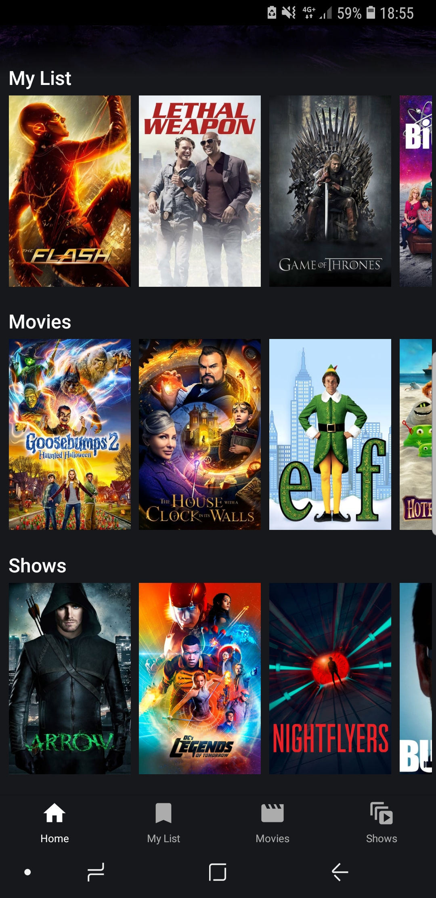
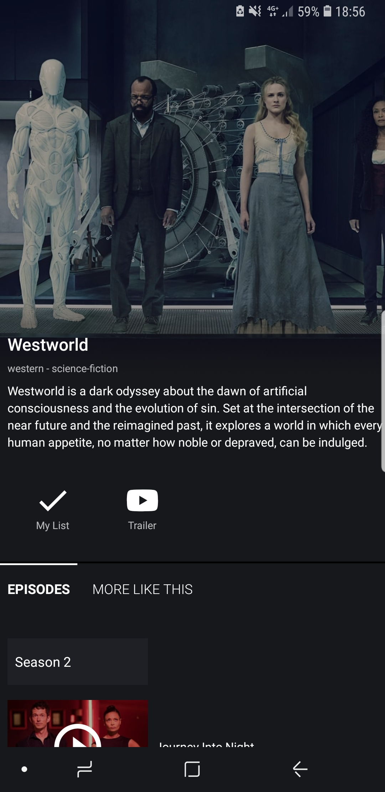
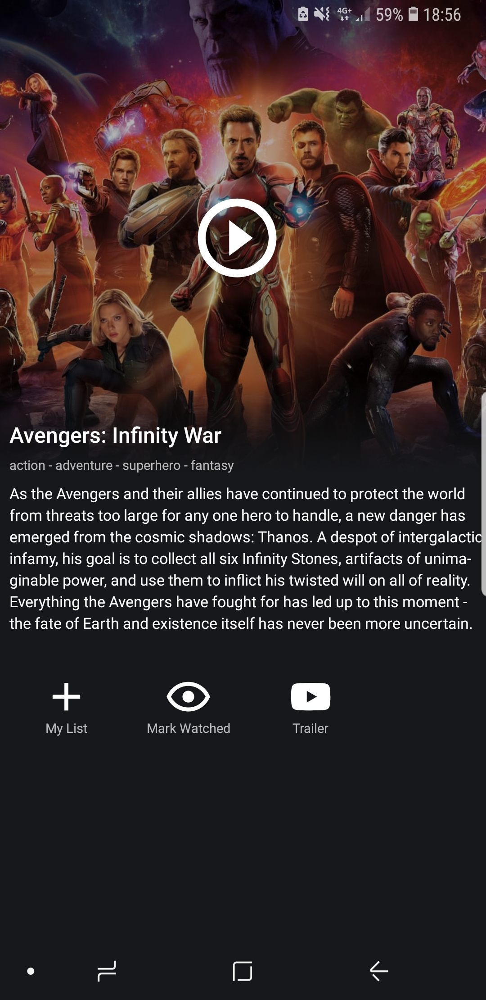

<h1 align="center">
  
  <br />
  Popcorn Native
</h1>

<h3 align="center">A Modern and Experimental Popcorn Time App</h3>

<div align="center">
  <a target="_blank" href="https://travis-ci.org/TriPSs/popcorn-native/">
    
  </a>
  <a target="_blank" href="https://david-dm.org/tripss/popcorn-native" title="dependencies status">
  	
  </a>
  <a target="_blank" href="https://david-dm.org/tripss/popcorn-native?type=dev" title="devDependencies status">
    
  </a>
    <a target="_blank" href="https://gitter.im/pct-org/app?utm_source=badge&utm_medium=badge&utm_campaign=pr-badge&utm_content=badge">
    
  </a>
  <a target="_blank" href="https://github.com/tripss/popcorn-native/pulls">
    
  </a>
</div>

<br />

## Getting started:
- **I am a tester:** Download the latest build from the [releases](https://github.com/tripss/popcorn-native/releases) section.

- **I am a developer:** Compile the project with the installation steps below.

## Installation:
```bash
git clone https://github.com/tripss/popcorn-native.git
cd popcorn-native

# Install dependencies
yarn install

# Start metro
yarn start

# Start app on connected android device
yarn android

# Build an install non dev build on connected device
yarn build-and-install

```

## Contributing:
Please see the [contributing guide](https://github.com/tripss/popcorn-native/blob/master/CONTRIBUTING.md)

## Screenshots

Home Screen | Home Screen
:-------------------------:|:-------------------------:
  | 

Show Screen |  Movie Screen
:-------------------------:|:-------------------------:
  |

